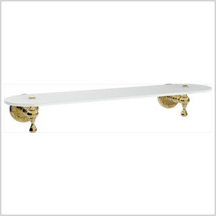

<!-- meta tags details, will be assigned to meta tags inside header by js -->
<div id="meta-info">
<details><summary>meta info</summary>

> * Title: <i id="md-title">LazZiya.ImageResize - Image Frame (border)</i>
> * Keywords: <i id="md-keywords">asp.net-core, image, resize, crop, scale, text watermark, animated, gif, conditional, frame, border, fill</i>
> * Description: <i id="md-description">Image resizing tool for .Net applications to resize images and add text/image watermark, Supports most common image types including animated gif.</i>
> * Author: <i id="md-author">Ziya Mollamahmut</i>
> * Date: <i id="md-date">11-Mar-2021</i>
> * Image: <i id="md-image">https://github.com/LazZiya/Docs/raw/master/LazZiya.ImageResize/v4.0/images/lazziya-imageresize-logo.png</i>
> * Image-alt: <i id="md-image-alt">LazZiya.ImageResize Logo</i>
> * Version: <i id="md-version">v4.0</i>

</details>
</div>

By [Ziya Mollamahmut](https://github.com/LazZiya)

# Image Frame

Draw a frame around the image, speicify frame style, color, distance, ...etc. This method will not resize the from image, but will add additional space around it to draw the frame.

## Why Image Frame?
Imagine you have a shopping site, and some products has wide images, while other products has image hight more than other. What is the ideal size to fit all different images in a fixed frame? in some cases you can fix it with CSS by defining `max-width` and `max-height`. But that is not the ideal solution!

#### Sample:
For example see below two images with different sizes:


and 


When we do resize above two images with `Scale` method:
````csharp
using(var img = Image.FromFile("my-image-file.jpg")
{
    // Scale image by its width and height, till it fits.
    img.Scale(300, 300)
       .SaveAs("wwwroot/upload/new-image-with-frame.png");
}
````
The result is like below:


Now lets just add a frame after resize:
````csharp
using(var img = Image.FromFile("my-image-file.jpg")
{
    // Scale image by its width and height, till it fits.
    img.Scale(300, 300)
       .AddFrame(310,310, new ImageFrameOptions { FillColor = Color.White })
       .SaveAs("wwwroot/upload/new-image-with-frame.png");
}
````
Now we have two identical images :)




### Change Image Frame Options
You can play with `ImageFrameOptions` to customize color, width and shape of the frame and the background. You may even use your imagination to create fantastic frames like below :)

Original image: 


Resized with multiple frames: 


````csharp
using(var img = Image.FromFile("my-image-file.jpg")
{
    img.ScaleAndCrop(150, 150)
        .AddFrame(265, 265, new ImageFrameOptions { Thickness = 3, FrameColor = Color.DarkSlateBlue, FillColor = Color.Snow })
        .AddFrame(new ImageFrameOptions { Thickness = 5, FrameColor = Color.BlueViolet })
        .AddFrame(new ImageFrameOptions { Thickness = 4, FrameColor = Color.Gold, DashStyle = DashStyle.Dot })
        .AddFrame(new ImageFrameOptions { Thickness = 8, FrameColor = Color.CornflowerBlue, DashStyle = DashStyle.Dash })
        .AddFrame(new ImageFrameOptions { Thickness = 4, FrameColor = Color.PaleGoldenrod, DashStyle = DashStyle.Dot })
        .AddFrame(new ImageFrameOptions { Thickness = 10, FrameColor = Color.DeepSkyBlue })
        .AddFrame(new ImageFrameOptions { Thickness = 4, FrameColor = Color.DarkSlateBlue })
        .SaveAs("wwwroot/upload/new-image.png");
}
````

All methods are available with the conditional `If` variation.